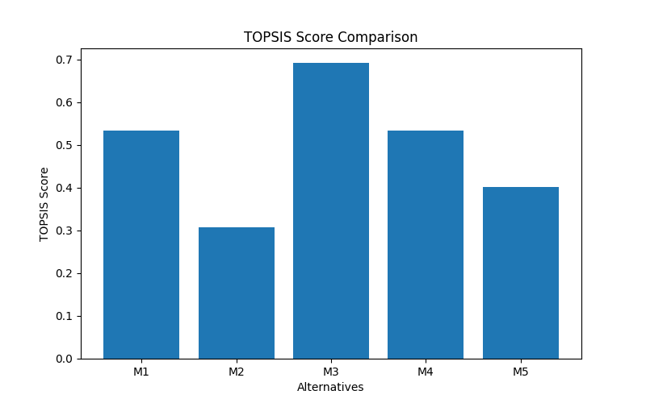

# Topsis-Saniya-102303183

`Topsis-Saniya-102303183` is a Python library for solving **Multiple Criteria Decision Making (MCDM)** problems using the **Technique for Order of Preference by Similarity to Ideal Solution (TOPSIS)**.

---

## Methodology

TOPSIS is based on the concept that the chosen alternative should have the shortest geometric distance from the positive ideal solution (best possible value) and the longest geometric distance from the negative ideal solution (worst possible value).

### Step-by-Step Implementation:

1. **Normalization**  
   The decision matrix is normalized to scale all criteria to a common range.

2. **Weighting**  
   The normalized matrix is multiplied by the weights provided for each criterion.

3. **Ideal Best & Ideal Worst**  
   Ideal best and ideal worst values are identified based on impacts (+ or -).

4. **Distance Calculation**  
   Euclidean distance from ideal best and ideal worst is calculated.

5. **TOPSIS Score**  
   Final score is calculated and alternatives are ranked.

---

## 📊 Result Visualization

The following graph shows the TOPSIS score comparison of all alternatives:



---

## Installation

```bash
pip install Topsis-Saniya-102303183
